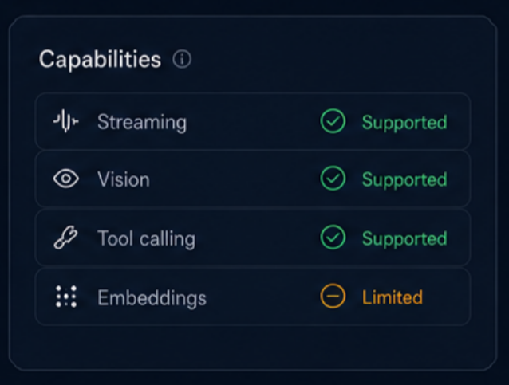
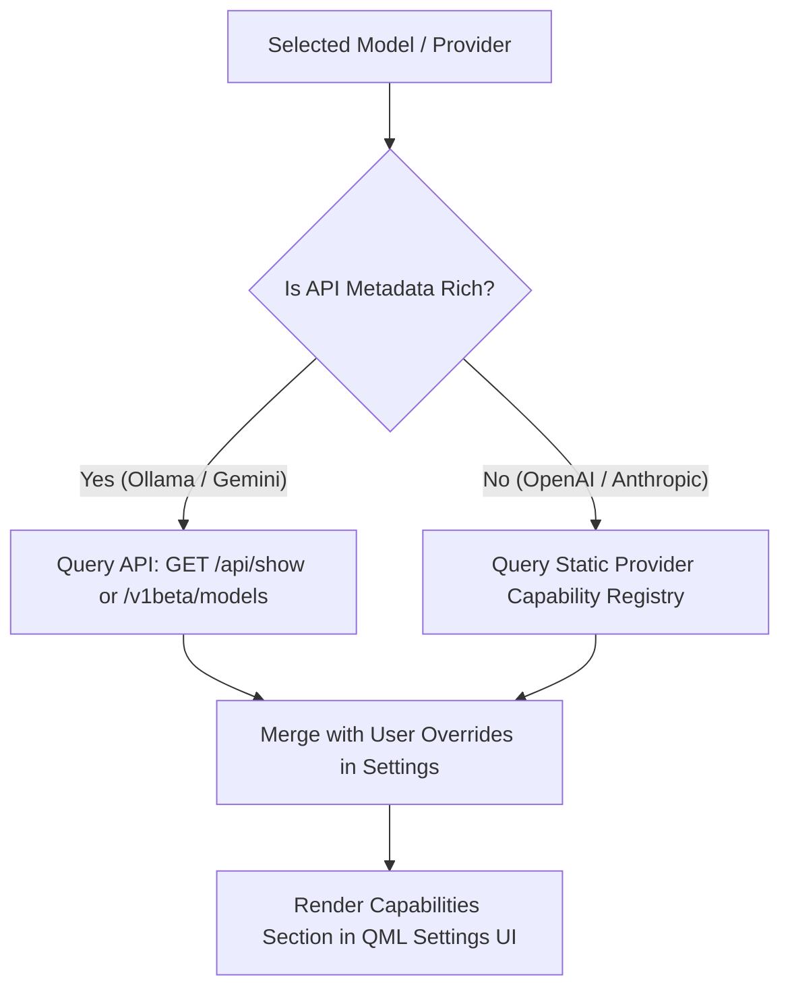

# Proposal & Implementation Plan: "Capabilities" Section in Provider Settings

**Document Version**: 1.0  
**Date**: 2026-07-31  
**Target Component**: `holonight-ai` Provider Configuration Settings UI (QML & C++ Provider Registry)  
**Status**: Proposal for User Review

---

## 1. Goal & Context

The goal is to design and implement the **Capabilities** section within the **Provider / Model Settings Page**. The user provided an initial design mockup ([mockup](uploaded_media_1785505340348.png)) showing a clean dark-themed card containing capabilities like *Streaming*, *Vision*, *Tool calling*, and *Embeddings* with status indicators (`Supported` / `Limited`).

This document proposes a **comprehensive taxonomy of capability entries**, capability status definitions, data retrieval strategies per AI provider (Ollama, OpenAI, Google Gemini, Anthropic), and QML layout recommendations.

---

## 2. Mockup Review & Analysis

The user's reference mockup:

### Key Strengths of the Design:
- **Clean Row Layout**: Icon + Label on the left, Status Badge on the right.
- **Visual Status Differentiation**: Distinct color coding (Green for `Supported`, Amber for `Limited`, Gray/Red for `Unsupported`).
- **Info Icon (`ⓘ`)**: Header tooltip providing context on how capabilities are detected or configured.

---

## 3. Recommended Capability Entries (Taxonomy)

To ensure the list is future-proof and covers modern AI provider features without overwhelming the user, we recommend categorizing capabilities into **Core Interaction**, **Multimodal Capabilities**, **Reasoning & Tools**, and **Auxiliary Services**.

### Category 1: Core Text & Interaction
| Entry Name | Icon | Description | Example Support |
| :--- | :---: | :--- | :--- |
| **Streaming** | `nfc` / `waves` | Real-time token streaming via Server-Sent Events / WebSockets. | Ollama, OpenAI, Anthropic, Gemini |
| **System Instructions** | `terminal` / `tune` | Support for developer system prompts / instructions. | OpenAI, Anthropic, Gemini, Ollama |
| **Structured Outputs** | `json` / `code` | Guaranteed JSON schema output formatting (`response_format`). | OpenAI, Gemini, Ollama (v0.3+), Claude (Tools) |
| **Prompt Caching** | `bolt` / `memory` | Reusing prefix key-value context to reduce latency and cost. | Anthropic (Claude 3.5/3.7), OpenAI, DeepSeek |

### Category 2: Multimodal Inputs & Outputs
| Entry Name | Icon | Description | Example Support |
| :--- | :---: | :--- | :--- |
| **Vision** | `eye` / `image` | Processing image inputs, screenshots, and visual documents. | GPT-4o, Claude 3.5/3.7, Gemini 1.5/2.0, LLaVA |
| **Audio Processing** | `mic` / `volume` | Native speech recognition or audio input processing. | GPT-4o Audio, Gemini 2.0 Flash |
| **Video Understanding** | `video` / `film` | Multi-frame video clip analysis. | Gemini 1.5 Pro / 2.0 Flash |
| **Document Processing** | `file-text` | Native PDF / inline document parsing. | Claude 3.5, Gemini 1.5 |

### Category 3: Reasoning & Advanced Capabilities
| Entry Name | Icon | Description | Example Support |
| :--- | :---: | :--- | :--- |
| **Tool Calling** | `wrench` / `tools` | Native function calling for agentic workflows & local execution. | GPT-4o, Claude 3.5/3.7, Gemini, Llama 3.1+ |
| **Reasoning / Thinking** | `brain` / `sparkles` | Chain-of-Thought / reasoning token output (budget control). | OpenAI o1/o3-mini, Claude 3.7 Sonnet, DeepSeek R1 |
| **Web Search / Grounding** | `globe` / `search` | Live internet grounding / web search integration. | Gemini (Google Search), OpenAI (SearchGPT) |
| **Code Execution** | `code-sandbox` | Server-side Python / sandbox execution environment. | Gemini, OpenAI Assistant API |

### Category 4: Embeddings & Vector Retrieval
| Entry Name | Icon | Description | Example Support |
| :--- | :---: | :--- | :--- |
| **Embeddings** | `grid` / `layers` | Vector embedding generation for vector DB / RAG. | OpenAI (`text-embedding-3`), Ollama (`nomic-embed`), Gemini |
| **Reranking** | `sort` / `list-filter` | Cross-encoder relevance reranking for search results. | Cohere, Local Rerankers |

---

## 4. Status Indicator Specification

We suggest 4 distinct status states for capability badges:

| Status State | Color | Badge Icon | Meaning |
| :--- | :---: | :---: | :--- |
| **Supported** | `#22c55e` (Green) | `✓` (Check) | Fully supported natively by the provider API and application. |
| **Limited** | `#f59e0b` (Amber) | `⊝` / `-` (Dash) | Supported with constraints (e.g. emulated via prompt, lower context limit, or partial format). |
| **Unsupported** | `#6b7280` (Gray) / `#ef4444` (Red) | `✕` (Cross) | Not supported by this provider model. |
| **Auto-Detecting** | `#3b82f6` (Blue) | `⟳` (Spinner) | Verification request in progress. |

---

## 5. Data Sourcing Strategy (How capabilities are determined)

Capabilities should be populated dynamically using a 3-tier fallback architecture:

1. **Native API Inspection**:
   - **Ollama**: Query `POST /api/show` to check GGUF architecture (`families`, `parameters`, `template` tool syntax).
   - **Google Gemini**: Query `GET /v1beta/models` to check `supportedGenerationMethods` and `inputTokenLimit`.
2. **Static Capability Catalog** (`ProviderRegistry` C++ module):
   - Maintains explicit capabilities for cloud providers like OpenAI (`gpt-4o`, `o3-mini`) and Anthropic (`claude-3-7-sonnet`, `claude-3-5-haiku`).
3. **User Manual Override (Optional Power-User Toggle)**:
   - Allow users to manually override a capability (e.g., enable *Tool calling* for a custom local proxy or fine-tuned model).

---

## 6. Decided Design Choices & Configuration

Based on your feedback, the implementation will follow these confirmed design choices:

1. **UI Layout**: **Compact Default List + 'Show All' Toggle**
   - Displays the 6 core capabilities by default: **Streaming**, **Vision**, **Tool calling**, **Structured outputs**, **Reasoning / Extended Thinking**, and **Embeddings**.
   - Includes a "Show All Capabilities" expandable toggle to reveal full category breakdown (Audio, Video, Prompt Caching, Web Search, Code Sandbox, Reranking).

2. **Interactivity**: **Read-Only Diagnostic Badges**
   - Status badges (`Supported`, `Limited`, `Unsupported`, `Auto-Detecting`) are strictly read-only diagnostic indicators computed automatically from the API inspection layer and provider catalog.

3. **Context Window & Token Limits**:
   - Token limits (e.g. `128k input / 16k output`) are displayed in a dedicated summary badge in the section header alongside the provider/model status.
