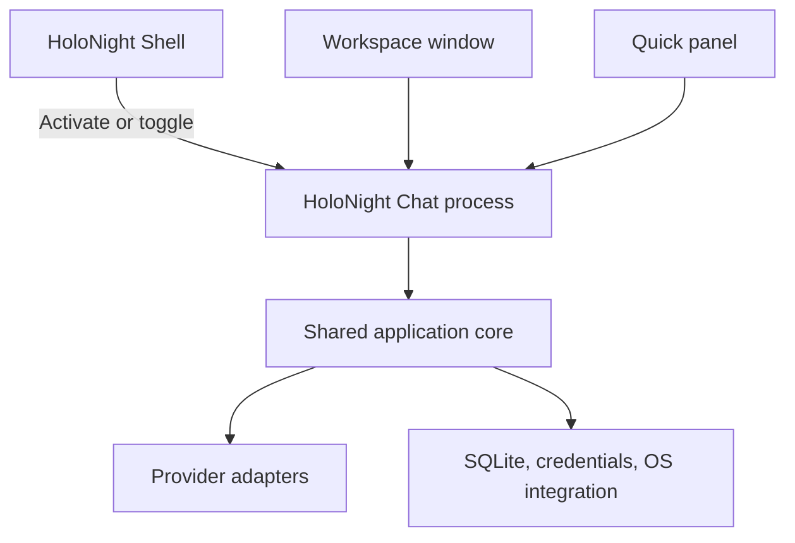
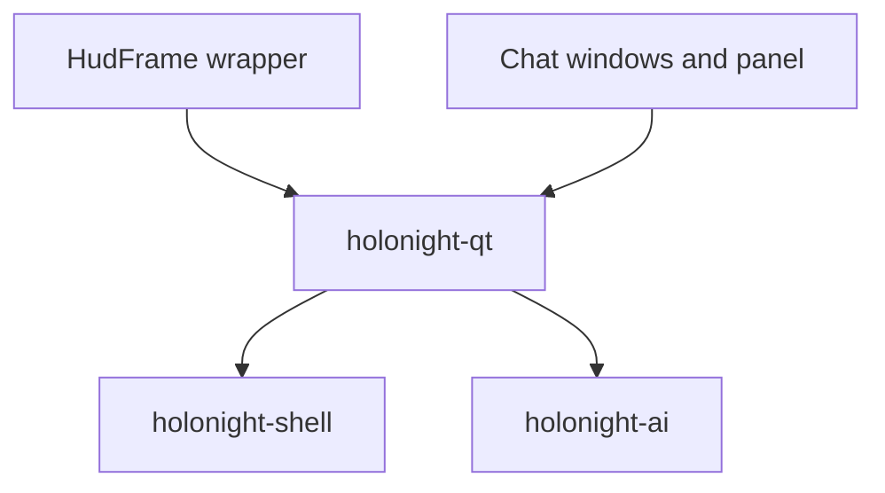

My recommendation is a hybrid architecture: build HoloNight AI Chat as a separate repository and application process, give it a proper standalone window as the canonical interface, then add a compact left-side panel controlled by HoloNight Shell. Both surfaces should use the same application state and reusable QML components.

## Repository boundary

| Concern                | Inside `holonight-shell`                               | Separate repository                       |
| ---------------------- | ------------------------------------------------------ | ----------------------------------------- |
| Initial implementation | Slightly faster                                        | Small amount of extra setup               |
| Release lifecycle      | Coupled to shell releases                              | Independent, faster iteration             |
| Reliability            | Provider or database failures can affect the shell     | Chat failures remain isolated             |
| Dependencies           | Network, storage, and AI code inflate the shell        | Shell stays focused and lightweight       |
| Portability            | Effectively tied to HoloNight Shell                    | Usable under KDE, GNOME, Niri, Sway, etc. |
| Security               | Credentials and future tools live in the shell process | Clearer credential and execution boundary |
| Testing                | Mixed with compositor and shell behavior               | Provider/core tests can run headlessly    |
| Future agents and MCP  | Pushes the shell toward a “god process”                | Natural extension of the chat application |

The separate repository does introduce packaging and IPC work, but HoloNight already has the right shared boundaries:

* `holonight-qt` supplies visual styling.
* `holonight-icons` supplies icons.
* The chat app owns AI behavior and storage.
* `holonight-shell` supplies activation, shortcuts, and desktop affordances.

I would name the repository `holonight-ai` and keep `holonight-chat` as the executable. That leaves room for an eventual runtime or service without making the first application unnecessarily broad.

## Window versus sidebar

A sidebar-only design will feel elegant for short questions, but it will become restrictive as soon as you add code blocks, long answers, conversation history, file context, tool activity, model settings, or project inspection.

A window-only design is functionally stronger but loses some of the “native desktop assistant” character.

Use two presentation modes:

* **Workspace window:** the complete application—conversation navigation, rich messages, settings, provider management, context, and eventually tool inspection.
* **Quick panel:** a narrow left-side surface for asking something, continuing the current conversation, viewing a streaming answer, and expanding into the window.

The quick panel should not become a second implementation. It should share the same message delegates, composer, conversation model, and active request with the full window. “Expand” must preserve the conversation, scroll position, draft, and running response.

I would let the chat application create its own panel surface. The shell should only tell it to show, hide, or activate. Embedding the actual chat UI inside the shell process would recreate the coupling that the separate repository is meant to avoid.



Initially, one running chat process can own both surfaces. A separate background daemon is unnecessary until there is a real need for work to continue without either UI.

## Internal architecture

Start as a modular monolith, not as a collection of services:

```text
holonight-ai/
├── apps/
│   └── chat/
├── src/
│   ├── domain/          # conversations, messages, models, attachments
│   ├── application/     # sending, retrying, cancellation, orchestration
│   ├── providers/       # Ollama, OpenAI, Anthropic, Google
│   ├── persistence/     # SQLite repositories and migrations
│   ├── credentials/     # Secret Service/KWallet integration
│   └── platform/        # D-Bus, notifications, desktop activation
├── qml/
│   ├── shared/          # message, composer, model picker
│   ├── workspace/       # full-window presentation
│   └── quickpanel/      # compact presentation
├── tests/
└── docs/adr/
```

C++/Qt/QML remains a good choice here. Provider APIs are mostly HTTP, JSON, and streaming protocols, so you can avoid bundling large vendor SDKs. If future tools are written in Python or another language, MCP provides a better process boundary than embedding those runtimes into the UI.

### Provider abstraction

Do not reduce every provider to a lowest-common-denominator `sendPrompt()` interface. Model capabilities differ too much.

Each adapter should expose:

* Available models and configurable endpoints.
* Streaming support.
* Text, image, and file capabilities.
* Tool-calling support.
* System-instruction and reasoning options.
* Context and output limits when known.
* Usage information and provider-specific errors.

The application should consume a normalized event stream such as content deltas, tool calls, usage, completion, cancellation, and errors. Preserve provider-specific metadata alongside normalized messages so newer features can be added without corrupting or losing earlier conversations.

Use a provider registry from the beginning, but postpone dynamically loaded third-party plugins until the internal interfaces have proven stable.

### Tool activity architecture

The implemented tool boundary follows one ownership rule: providers translate protocol, tools
execute behavior, presenters derive semantics, and QML renders visuals. Provider adapters receive a
neutral catalog and own their native codecs. A local registration combines a stable definition, an
asynchronous executor, and a presenter; the application orchestrator owns lifecycle and dispatches
only local-client requests. Persistence retains separate invocation/result ledger records for exact
provider history, while the transcript pairs them into one activity by provider call ID.

The shared `ToolActivityCard` renders status, disclosure, cancellation capability, accessibility,
and raw diagnostics. A renderer registry selects specialized expanded content—currently a bounded
`ListFiles` directory preview—or a safe generic fallback for historical, provider-hosted, external,
unknown, and malformed activities. See
[`docs/sdd/tool-activity-rendering/`](sdd/tool-activity-rendering/) for the detailed contracts.

Treat future tool policy as three independent decisions:

* **Availability:** whether this build/provider/model can advertise and route the tool.
* **Permission:** whether this invocation may execute, including approval, denial, and sandbox rules.
* **Disclosure:** which semantic and raw inputs/results the UI reveals at each lifecycle stage.

The current Anthropic setting is an availability gate. It is not a permission grant or a disclosure
policy, and future settings should not overload it with either responsibility.

### Persistence and credentials

Use SQLite with explicit schema migrations for conversations, messages, attachments, request state, and provider metadata. Store credentials through the desktop secret service, never in the ordinary HoloNight configuration file.

Keep provider configuration separate from credentials:

* Configuration: base URL, model, temperature, context settings.
* Secret storage: API keys and refresh tokens.
* Conversation data: SQLite.
* Temporary provider responses and downloads: XDG cache.

### Shell integration

Keep the initial interface deliberately small:

* Activate the application.
* Toggle the quick panel.
* Start a new conversation.
* Open a particular conversation.
* Optionally prefill the composer.
* Report coarse state such as idle, generating, or attention required.

Use standard desktop/D-Bus activation where possible, with a small custom D-Bus interface for panel-specific behavior. The shell should not receive provider credentials, complete conversation databases, or raw tool execution requests.

## Future extensibility

The major future boundary is not “chat versus shell”; it is **conversation UI versus agent execution**.

When MCP, project scanning, desktop actions, or autonomous jobs arrive, introduce a tool runtime with:

* Per-tool permissions and visible approval gates.
* Structured tool calls and results.
* Cancellation and timeouts.
* Sandboxed or out-of-process execution.
* Persistent job state.
* Audit history showing what ran and why.

Only then consider extracting `holonight-ai-service`. It becomes justified when responses must continue after the UI closes, several frontends need simultaneous access, or scheduled/background agents are introduced. Designing an application-core façade now will make that extraction possible without paying the daemon complexity upfront.

## Concrete recommendation and roadmap

Adopt a separate `holonight-ai` repository with a single `holonight-chat` Qt application. Make the standalone window the canonical UI. Add the left quick panel later as another surface owned by the same process, controlled by the shell over D-Bus.

1. **Foundation:** create the modular repository, domain types, streaming event interface, provider registry, cancellation, and headless tests. Record the repository, process, persistence, and provider decisions as short ADRs.

2. **Usable chat window:** implement the full window with Ollama first, Markdown and code rendering, streaming, stop/retry, model selection, and in-memory conversations.

3. **Persistence and providers:** add SQLite migrations, secret-service integration, OpenAI, Anthropic, and Google adapters, capability negotiation, provider-specific error reporting, and configurable Ollama endpoints.

4. **HoloNight integration:** add single-instance activation, the compact left panel, global shortcut, expand-to-window behavior, desktop notifications, and a thin shell proxy. Do not move chat logic into `holonight-shell`.

5. **Context and tools:** add attachments and project context first; then MCP as an explicitly permissioned, out-of-process subsystem. Extract a background service only when persistent jobs or multiple simultaneous clients make it necessary.

This keeps the first version straightforward while preserving a clean path from “simple multi-provider chat” to a real HoloNight desktop assistant.

---

The AI application should not implement its own frame system, but I also would not move `HudFrame` unchanged into a shared library. Extract the reusable geometry and appearance system into `holonight-qt`, then keep `HudFrame` as a shell-specific wrapper.

## Separate the three responsibilities

| Component             | Location          | Responsibility                                                               |
| --------------------- | ----------------- | ---------------------------------------------------------------------------- |
| `HnSurfaceFrame`      | `holonight-qt`    | Drawing rounded/chamfered surfaces, borders, backgrounds and focus outlines  |
| `HnApplicationWindow` | `holonight-qt`    | Shared client area, optional title bar and window content layout             |
| `HudFrame`            | `holonight-shell` | Shell-specific margins, blur, layer-surface behavior, masks and HUD defaults |

The dependencies become:



For compatibility, the existing `HudFrame` can retain its current API while delegating rendering:

```qml
// holonight-shell/components/HudFrame.qml
HnSurfaceFrame {
    surfaceRole: HnSurfaceRole.Hud
}
```

The chat repository then imports `Holonight` and uses `HnApplicationWindow` or `HnSurfaceFrame`; it never imports anything from `holonight-shell`.

## Regular windows require special handling

The physical outer border of a normal Wayland window should usually remain compositor-owned:

* Hyprland controls its border, shadow and outer rounding.
* Arbitrary slanted client geometry may not match the compositor border.
* Transparent chamfered corners can produce strange shadows and rectangular input regions.
* Other compositors may treat client-side decorations differently.

Therefore:

* Let the compositor own the outermost shape of ordinary windows.
* Let `HnApplicationWindow` provide the HoloNight title bar and content surface.
* Express the slanted HoloNight identity inside the client area rather than cutting the actual Wayland window.
* For shell panels, popups and layer surfaces, `HnSurfaceFrame` can control the complete visible shape.

This also prevents a double-border effect around the AI and settings windows.

## Use semantic roles, not raw radii everywhere

Components should request a role:

```qml
HnSurfaceFrame {
    surfaceRole: HnSurfaceRole.Panel
}
```

The shared appearance system resolves that role into actual geometry.

Suggested roles:

* `Window`
* `Panel`
* `Popup`
* `Card`
* `Menu`
* `Tooltip`
* `Control`
* `Pill`
* `Hud`

This allows cards and tooltips to remain visually related without requiring them to have literally identical corners.

### Recommended hybrid defaults

| Role           |     Radius |       Chamfer | Treatment                   |
| -------------- | ---------: | ------------: | --------------------------- |
| Window content |      14 px |         10 px | One signature inner chamfer |
| Sidebar/panel  |      14 px |         10 px | Strong HoloNight geometry   |
| Popup          |      12 px |          8 px | Slightly more compact       |
| Card           |      10 px |        0–6 px | Mostly rounded and quiet    |
| Menu           |       8 px |          0 px | Simple and readable         |
| Tooltip        |       6 px |          0 px | Avoid ornamental geometry   |
| Pill           | Height ÷ 2 |          0 px | Always pill-shaped          |
| Button/control |       8 px | Optional 4 px | Depends on emphasis         |

My preferred default is **Hybrid**: large structural surfaces carry the slanted signature, while small interactive elements remain rounded. Making every checkbox, tooltip and message card slanted would become visually noisy.

## Centralized corner settings

Corner settings should be global HoloNight appearance settings, not independent shell and AI settings.

Expose a compact user-facing configuration:

* **Corner style:** Hybrid, Rounded, Chamfered
* **Corner size:** Compact, Default, Expressive
* **Advanced:** base radius and base chamfer size
* A live preview showing a window, card, popup and pill together

Avoid exposing separate radius fields for every component. Internally, resolve the selected profile through semantic multipliers.

For example:

```json
{
  "schemaVersion": 1,
  "shape": {
    "profile": "hybrid",
    "scale": 1.0,
    "overrides": {
      "baseRadius": 10,
      "baseChamfer": 8
    }
  }
}
```

The overrides can be omitted unless advanced settings are enabled. That permits defaults to evolve without leaving every user locked to obsolete numeric values.

## Configuration ownership

`holonight-qt` should own:

* Shape enums and semantic roles.
* Default profiles.
* Role-to-geometry resolution.
* Shared appearance-file parsing.
* A process-local `HnAppearance` singleton.
* Change notifications.

Store only shared visual settings in something like:

```text
$XDG_CONFIG_HOME/holonight/appearance.json
```

Keep application settings separate:

```text
$XDG_CONFIG_HOME/holonight-shell/config.json
$XDG_CONFIG_HOME/holonight-ai/config.json
```

Every process loads the shared appearance file through `HnAppearance`. For live updates, watch the containing directory rather than only the file because atomic configuration writes commonly replace the file inode. D-Bus appearance notifications can be added later but are unnecessary initially.

Components should support an escape hatch without encouraging local customization:

```qml
HnSurfaceFrame {
    surfaceRole: HnSurfaceRole.Card

    // Normally inherited:
    cornerStyleOverride: HnCornerStyle.Inherit
    radiusOverride: NaN
    chamferOverride: NaN
}
```

## Recommended migration

1. Add `HnAppearance`, `HnSurfaceRole`, shape profiles and `HnSurfaceFrame` to `holonight-qt`.
2. Refactor the current `HudFrame` into a shell wrapper around `HnSurfaceFrame`.
3. Introduce `HnApplicationWindow` for the AI main window and settings window.
4. Use `HnSurfaceFrame` with the `Panel` role for the left quick panel.
5. Move shared corner configuration into `appearance.json` and add live reload.
6. Gradually migrate existing shell popups and cards; avoid rewriting everything in one pass.

So the concrete decision is: **share the frame engine and design tokens through `holonight-qt`, retain `HudFrame` as a shell semantic wrapper, and centralize corner customization as role-based global appearance profiles.**
