# UtilityTaskRunner — Design

Status: Stage 2 (Design), covers all 22 requirements in `SPEC.md` (REQ-F-001..010, REQ-NF-001..006,
REQ-C-001..004, REQ-U-001..002). Every design decision below is traced to the REQ ID(s) it satisfies.

---

## 1. Overview

`UtilityTaskRunner` is a new `holonight_application` component that owns four provider-adapter
instances (Ollama, OpenAI, Anthropic, Google) fully isolated from `ChatViewModel`'s own four, and
uses them to issue one-shot, non-streaming model calls for background utility work. Its sole
consumer this cycle is **asynchronous conversation-title generation**: after a conversation's first
assistant response reaches `Complete`, `UtilityTaskRunner` silently, exactly once, asks a resolved
model to produce a short descriptive title, and — on success only — that title replaces the
synchronously-derived fallback title without blocking the UI or requiring user action.

---

## 2. Components

| Component | Module | Why this module |
|---|---|---|
| `holonight_domain::TitleSource` (new enum) | `holonight_domain` | Domain-layer vocabulary enum, same tier as `MessageRole`/`MessageStatus` (`src/domain/include/holonight_domain/message.h`). Kept as a **standalone** enum, *not* added to the `Conversation` class — this mirrors the existing precedent of `last_model_id`, which is UI/persistence bookkeeping about a conversation that deliberately lives outside the `Conversation` aggregate (in `holonight_persistence::ConversationSummary` and `ChatViewModel` members), not inside it. `Conversation` itself needs no changes. |
| `holonight_config::UtilityConfig` (new struct) | `holonight_config` | Same shape-pattern as `OllamaProviderConfig`/`OpenAIProviderConfig`/etc. in `provider_config.h` (REQ-F-001), but *not* a per-provider config, so it gets its own header `utility_config.h` rather than being folded into `provider_config.h`. `ConfigRepository` gains `loadUtilityConfig()`/`saveUtilityConfig()` following the exact same read-merge-write pattern as the four existing `load*Config()`/`save*Config()` pairs. |
| `UtilityTaskRunner` (new class) | `holonight_application` | Same architectural tier as `ChatController` — it owns provider instances and orchestrates `sendChat()` calls, but (like `ChatController`) has **no** `ConversationRepository` dependency; it only emits a result signal. Plain `QObject`, **not** `QML_ELEMENT`/`QML_SINGLETON` — REQ-C-001 forbids a settings UI and nothing else needs it from QML, so none of CLAUDE.md's `qt6_extract_metatypes`/`INTERFACE_SOURCES`-clear-twice machinery applies; it is added to `holonight_application`'s existing `add_library()` source list like `chat_controller.h/.cpp`. |
| `0003_add_title_source.sql` (new migration) | `holonight_persistence` (`migrations/`) | Follows `0001_init.sql`/`0002_add_message_model_id.sql`'s exact convention: a single SQL file registered in `MigrationRunner::builtInMigrations()` with the next version number. |
| `ConversationSummary::title_source` (new field) | `holonight_persistence` (`conversation_record.h`) | Mirrors the existing `std::optional<ModelId> last_model_id` field — conversation-level metadata carried alongside `id`/`title`/timestamps through the repository's existing signal plumbing. |
| `ConversationRepository::renameConversation(...)` (extended signature) | `holonight_persistence` | Gains a `holonight_domain::TitleSource` parameter with a default value that preserves every existing call site's behavior (REQ-F-006, REQ-C-003). |

No new top-level CMake target and no new static library are introduced — everything above is an
addition to the four existing modules (`holonight_domain`, `holonight_config`, `holonight_persistence`,
`holonight_application`), matching CLAUDE.md's module layout.

---

## 3. Data Flow

1. User sends the first message in a conversation whose `title_source` is `Fallback` (true for every
   newly-created conversation, REQ-C-003). `ChatViewModel::send()` appends the user + placeholder
   assistant `Message`s, persists them, and (unchanged code path, now explicit about source) calls
   `repository_->renameConversation(id, deriveConversationTitle(text), TitleSource::Fallback)`.
2. `ChatController` streams the assistant response; each `ContentDelta` updates `conversation_` and
   `MessageListModel` as today — unaffected by this design.
3. The stream reaches `Completed`. `ChatController` transitions the assistant `Message` to
   `MessageStatus::Complete` and invokes `ChatViewModel::onStreamEvent()`.
4. `onStreamEvent()` persists the settled message (existing `persistMessageSettled` call), then
   evaluates the trigger condition (§7): `conversation_->messages().size() == 2` (ordinal "this is
   the first assistant message ever" check) **and** `lastMessage.role() == Assistant` **and**
   `lastMessage.status() == Complete` **and** `current_title_source_ == TitleSource::Fallback`
   **and** `persistence_enabled_`.
5. If true, `ChatViewModel` calls
   `utility_task_runner_->requestTitleGeneration(conversationId, firstUserText, firstAssistantText, selected_model_id_)`.
6. `UtilityTaskRunner` inserts `conversationId` into its in-memory in-flight guard (REQ-NF-004/005),
   resolves the model via the fallback chain (§4, REQ-F-002), and — if resolution didn't say "skip"
   — waits for its own `ProviderRuntimeCoordinator` to report the resolved provider `Ready`.
7. `UtilityTaskRunner` builds a single synthetic prompt `Message` from the first user + first
   assistant text (REQ-F-004) and calls the resolved provider's `sendChat()`.
8. `UtilityTaskRunner` accumulates `ContentDelta` events into a buffer (§6). On `Completed`, if the
   buffer is non-empty it emits `titleGenerated(conversationId, title)`; on `Error`/empty result, it
   logs and does nothing further (REQ-F-007/008). Either way, `conversationId` is removed from the
   in-flight guard — no retry is ever scheduled (REQ-C-002).
9. `ChatViewModel::onTitleGenerated()` (only reachable on success) calls
   `repository_->renameConversation(conversationId, title, TitleSource::Generated)`.
10. `ConversationRepositoryWorker::renameConversation()` runs a **guarded** `UPDATE ... WHERE id =
    :id AND title_source = 'Fallback'` for `Generated` writes only. If 0 rows were affected (a manual
    rename raced in during generation), it silently does not emit `conversationRenamed` — the user's
    manual title wins (REQ-NF-004/005, REQ-F-006).
11. On success, `conversationRenamed(summary)` fires through the existing signal chain;
    `ChatViewModel::onConversationRenamed()` updates `conversation_->setTitle()`,
    `current_title_source_`, and `ConversationListModel` exactly as it already does for manual
    renames — **no new QML wiring is required**; the UI updates for free because it already renders
    from these same reactive sources (REQ-NF-003).

```mermaid
sequenceDiagram
    participant CC as ChatController
    participant CVM as ChatViewModel
    participant UTR as UtilityTaskRunner
    participant PRC as UTR's ProviderRuntimeCoordinator
    participant P as Resolved Provider (isolated instance)
    participant Repo as ConversationRepository

    CC->>CVM: onStreamEvent(Completed) [assistant msg]
    CVM->>CVM: persistMessageSettled()
    CVM->>CVM: check trigger (size==2, role, status, title_source==Fallback)
    alt trigger true
        CVM->>UTR: requestTitleGeneration(id, userText, assistantText, chatModel)
        UTR->>UTR: in-flight guard insert(id)
        UTR->>UTR: resolveModel(override=nullopt, config, chatModel)
        UTR->>PRC: readiness(providerId)
        alt not Ready
            PRC-->>UTR: MissingCredential/Unavailable
            UTR->>UTR: log + drop (silent failure, REQ-F-008)
        else Ready
            UTR->>P: sendChat(model, [promptMessage], onEvent)
            P-->>UTR: ContentDelta* (accumulate)
            P-->>UTR: Completed | Error
            alt success, non-empty text
                UTR->>CVM: titleGenerated(id, title)
                CVM->>Repo: renameConversation(id, title, Generated)
                Repo->>Repo: UPDATE ... WHERE title_source='Fallback'
                Repo-->>CVM: conversationRenamed(summary) [if rows affected > 0]
                CVM->>CVM: update conversation_, current_title_source_, ConversationListModel
            else failure or empty
                UTR->>UTR: log only, no signal (REQ-U-001/002)
            end
        end
        UTR->>UTR: in-flight guard remove(id)
    end
```



---

## 4. Interfaces / APIs

### 4.1 `holonight_domain::TitleSource`

```cpp
// src/domain/include/holonight_domain/title_source.h
#pragma once
#include <cstdint>

namespace holonight_domain {

enum class TitleSource : std::uint8_t { Fallback, Generated, Manual };

}  // namespace holonight_domain
```

### 4.2 `holonight_config::UtilityConfig`

```cpp
// src/config/include/holonight_config/utility_config.h
#pragma once
#include <holonight_domain/model_id.h>
#include <optional>

namespace holonight_config {

// REQ-F-001: single field, ModelId-shaped, empty/unset by default so the resolution chain
// (REQ-F-002) always falls through to the conversation's active chat model.
struct UtilityConfig {
  std::optional<holonight_domain::ModelId> default_utility_model;

  friend bool operator==(const UtilityConfig&, const UtilityConfig&) = default;
};

}  // namespace holonight_config
```

`ConfigRepository` additions (same pattern as `loadOllamaConfig`/`saveOllamaConfig`):

```cpp
[[nodiscard]] UtilityConfig loadUtilityConfig() const;
[[nodiscard]] std::expected<void, QString> saveUtilityConfig(const UtilityConfig& config) const;
```

`config.json` shape (new top-level key, **not** nested under `"providers"` since it is not a
per-provider config):

```json
{
  "utility": {
    "default_utility_model": {
      "provider_id": "openai",
      "model_name": "gpt-4o-mini"
    }
  }
}
```

Absent `"utility"` key, absent `"default_utility_model"`, or a `null`/malformed value all load as
`std::nullopt` — never throws (REQ-F-001's "round-trips without data loss" plus the existing
`ConfigRepository` never-throws convention).

### 4.3 `UtilityTaskRunner`

```cpp
// src/application/include/holonight_application/utility_task_runner.h
#pragma once

#include "holonight_application/provider_runtime_coordinator.h"
#include "holonight_providers/anthropic_provider.h"
#include "holonight_providers/google_provider.h"
#include "holonight_providers/ollama_provider.h"
#include "holonight_providers/openai_provider.h"

#include <QObject>
#include <QSet>
#include <QString>

#include <holonight_config/utility_config.h>
#include <holonight_credentials/credential_store.h>
#include <holonight_domain/holonight_domain.h>
#include <memory>
#include <optional>

namespace holonight_application {

// Base URLs mirror chat configuration so custom endpoints remain consistent. Optional HTTP clients
// provide a deterministic test seam without sharing provider instances.
struct UtilityProviderEndpoints {
  QString ollama_base_url;
  QString openai_base_url;
  QString anthropic_base_url;
  QString google_base_url;
};

class UtilityTaskRunner : public QObject {
  Q_OBJECT

 public:
  explicit UtilityTaskRunner(holonight_credentials::CredentialStore* credential_store,
                             holonight_config::UtilityConfig utility_config, UtilityProviderEndpoints endpoints,
                             QObject* parent = nullptr);

  // Fire-and-forget (REQ-NF-003). No-op if conversationId is already in flight (REQ-NF-004/005).
  // taskOverride is accepted for API-surface completeness only (REQ-F-002's acceptance criterion);
  // any non-nullopt value is logged and ignored this cycle, never thrown (keeps this codebase's
  // zero-crash posture, REQ-U-001/002).
  void requestTitleGeneration(holonight_domain::ConversationId conversationId, QString firstUserText,
                              QString firstAssistantText, holonight_domain::ModelId chatFallbackModel,
                              std::optional<holonight_domain::ModelId> taskOverride = std::nullopt);

 Q_SIGNALS:
  // Emitted only on success (REQ-F-007/008): title is non-empty. No failure signal exists —
  // failure is silent by design (REQ-U-001, REQ-C-002).
  void titleGenerated(QString conversationId, QString title);

 private:
  [[nodiscard]] std::optional<holonight_domain::ModelId> resolveModel(
      const std::optional<holonight_domain::ModelId>& taskOverride,
      const holonight_domain::ModelId& chatFallbackModel) const;
  void dispatchGeneration(const QString& conversationKey, const holonight_domain::ModelId& model,
                          const QString& firstUserText, const QString& firstAssistantText);
  [[nodiscard]] holonight_providers::HttpRequestHandlePtr dispatchSendChat(
      const holonight_domain::ModelId& model, const std::vector<holonight_domain::Message>& history,
      const std::function<void(const holonight_domain::StreamEvent&)>& onEvent);
  void onProviderReady(const QString& conversationKey, const holonight_domain::ModelId& model,
                       const QString& firstUserText, const QString& firstAssistantText);

  std::shared_ptr<holonight_providers::OllamaProvider> ollama_provider_;
  std::shared_ptr<holonight_providers::OpenAIProvider> openai_provider_;
  std::shared_ptr<holonight_providers::AnthropicProvider> anthropic_provider_;
  std::shared_ptr<holonight_providers::GoogleProvider> google_provider_;
  std::unique_ptr<ProviderRuntimeCoordinator> provider_runtime_coordinator_;
  holonight_config::UtilityConfig utility_config_;

  struct InFlightGeneration {
    QString accumulated_text;
    holonight_providers::HttpRequestHandlePtr handle;
  };
  QHash<QString, InFlightGeneration> generations_;  // keyed by conversationId string
};

}  // namespace holonight_application
```

### 4.4 Persistence additions

```cpp
// holonight_persistence/conversation_record.h — ConversationSummary gains one field
struct ConversationSummary {
  QString id;
  QString title;
  QDateTime created_at;
  QDateTime updated_at;
  std::optional<holonight_domain::ModelId> last_model_id;
  holonight_domain::TitleSource title_source = holonight_domain::TitleSource::Fallback;  // NEW

  friend bool operator==(const ConversationSummary&, const ConversationSummary&) = default;
};
```

```cpp
// holonight_persistence/conversation_repository.h — extended signature, default preserves
// every existing call site's behavior unchanged (REQ-F-006's "manual rename ⇒ Manual" becomes the
// default; the one call site that must NOT default to Manual — fallback-title derivation in
// ChatViewModel::send() — is updated to pass TitleSource::Fallback explicitly).
virtual void renameConversation(QString conversationId, QString newTitle,
                                holonight_domain::TitleSource titleSource = holonight_domain::TitleSource::Manual) = 0;
```

`SqliteConversationRepository`'s override gains the same parameter and forwards it to the worker
via the existing queued `QMetaObject::invokeMethod()` pattern (no change to that mechanism).

### 4.5 SQL migration — `0003_add_title_source.sql`

```sql
-- src/persistence/migrations/0003_add_title_source.sql
ALTER TABLE conversations ADD COLUMN title_source TEXT NOT NULL DEFAULT 'Manual';
```

Registered in `MigrationRunner::builtInMigrations()`:

```cpp
Migration{
    .version = 3,
    .name = QStringLiteral("0003_add_title_source"),
    .sql = readResource(QStringLiteral(":/holonight_persistence/migrations/0003_add_title_source.sql")),
},
```

### 4.6 Worker SQL changes (`ConversationRepositoryWorker`)

- `listConversations()` / `loadConversation()` SELECTs add `title_source` to the column list;
  `summaryFromRecord()` reads it via a new `titleSourceFromText()` helper (mirrors
  `messageStatusFromText()`).
- `createConversation()`'s INSERT explicitly binds `title_source = 'Fallback'` (via a new
  `titleSourceToText()` helper) — **this explicit bind is required**; see §12 Known Risks for why
  relying on the column's `DEFAULT 'Manual'` here would be wrong.
- `renameConversation(conversationId, newTitle, titleSource)`:

```sql
-- titleSource == Manual or Fallback: unconditional, matches today's UPDATE semantics
UPDATE conversations SET title = :title, title_source = :title_source, updated_at = :updated_at
WHERE id = :id;

-- titleSource == Generated: guarded — a manual rename that raced in during generation must win
UPDATE conversations SET title = :title, title_source = :title_source, updated_at = :updated_at
WHERE id = :id AND title_source = 'Fallback';
```

For the `Generated` branch, the worker checks `query.numRowsAffected() == 0` and, if so, returns
without emitting `conversationRenamed` (the write was a no-op; whichever other writer won already
notified listeners).

---

## 5. Provider Instance Isolation & Credential Wiring

`ChatViewModel::create()` (`src/application/src/chat_view_model.cpp:47-94`) is the concrete
precedent: it builds four `shared_ptr<*Provider>` instances, each with its own
`QtNetworkHttpClient`, applies per-provider config (`setTemperature`, `setContextWindow`,
`setMaxOutputTokens`), then constructs one `ProviderRuntimeCoordinator` and calls
`registerProvider()` once per provider with a `ProviderRuntimeOperations` bundle of lambdas closing
over that *specific* `shared_ptr`.

`UtilityTaskRunner`'s constructor repeats exactly this shape, independently:

```cpp
UtilityTaskRunner::UtilityTaskRunner(holonight_credentials::CredentialStore* credential_store,
                                     holonight_config::UtilityConfig utility_config,
                                     UtilityProviderEndpoints endpoints, QObject* parent)
    : QObject(parent), utility_config_(std::move(utility_config)) {
  ollama_provider_ = std::make_shared<OllamaProvider>(std::make_shared<QtNetworkHttpClient>(),
                                                       endpoints.ollama_base_url);
  openai_provider_ = std::make_shared<OpenAIProvider>(std::make_shared<QtNetworkHttpClient>(),
                                                       endpoints.openai_base_url);
  anthropic_provider_ = std::make_shared<AnthropicProvider>(std::make_shared<QtNetworkHttpClient>(),
                                                             endpoints.anthropic_base_url);
  google_provider_ = std::make_shared<GoogleProvider>(std::make_shared<QtNetworkHttpClient>(),
                                                       endpoints.google_base_url);

  // Fixed, deliberately conservative — title generation wants short, deterministic output,
  // independent of whatever temperature/token-budget the user has dialed in for live chat
  // (REQ-NF-001's own rationale: stateful setters must not cross-contaminate).
  ollama_provider_->setTemperature(0.3);
  openai_provider_->setTemperature(0.3);
  anthropic_provider_->setTemperature(0.3);
  anthropic_provider_->setMaxOutputTokens(64);
  google_provider_->setTemperature(0.3);
  google_provider_->setMaxOutputTokens(64);

  provider_runtime_coordinator_ = std::make_unique<ProviderRuntimeCoordinator>(credential_store);
  // registerProvider() bound to THIS instance's providers — a second, independent registration
  // under the same provider_id strings ("ollama", "openai", ...) in a SEPARATE coordinator
  // instance. See §11 Alternative 3 for why the coordinator itself cannot be shared.
  provider_runtime_coordinator_->registerProvider(
      QStringLiteral("openai"), QStringLiteral("OpenAI"), CredentialPolicy::Required,
      ProviderRuntimeOperations{
          .set_credential = [p = openai_provider_](const QString& v) { p->setAuthToken(v); },
          .refresh = [p = openai_provider_](const auto& ok, const auto& err) { p->refresh(ok, err); },
          .models = [p = openai_provider_]() -> const std::vector<ModelId>& { return p->availableModels(); },
          // Deliberate no-op: writing UtilityTaskRunner's own discovered model list to config.json's
          // providers.openai.cached_models would race/thrash against ChatViewModel's own coordinator
          // writing the SAME key from ITS OWN provider instance's list. Model-list caching stays
          // ChatViewModel's exclusive responsibility.
          .persist_models = [] {}});
  // ... same shape for "ollama" (CredentialPolicy::Optional), "anthropic", "google"

  for (const QString& providerId : {QStringLiteral("ollama"), QStringLiteral("openai"),
                                    QStringLiteral("anthropic"), QStringLiteral("google")}) {
    provider_runtime_coordinator_->prepare(providerId);
  }
}
```

Both `ChatViewModel`'s and `UtilityTaskRunner`'s `ProviderRuntimeCoordinator` instances connect
independently to the **same** `holonight_credentials::CredentialStore*` in their constructors
(`provider_runtime_coordinator.cpp:9-34`) — confirmed safe by reading that file: every connection
is a plain Qt broadcast signal (`retrieveCompleted(provider_id, found, secret)`,
`storeCompleted(provider_id)`, `removeCompleted(provider_id)`, `ready()`, `unavailable(reason)`),
and each coordinator instance filters by `provider_id` against its **own** `registrations_` hash.
Two coordinators subscribed to one `CredentialStore` receive the same broadcasts and each drives its
own provider instances — no cross-talk (REQ-NF-002). This is the same "single `CredentialStore`,
multiple independent listeners" shape already used by
`ProviderSettingsControllerBase::credentialStore()` (`provider_settings_controller_base.h:85`),
which the four `*ProviderSettingsController` classes each connect to directly.

`ChatViewModel` owns the single `CredentialStore` instance
(`credential_store_` in `chat_view_model.h:221`) and exposes it read-only via
`credentialStoreForSettings()`; `ChatViewModel::create()` passes `credential_store_.get()` into
`UtilityTaskRunner`'s constructor before finishing its own `ProviderRuntimeCoordinator` setup —
`UtilityTaskRunner` never owns or constructs a `CredentialStore` itself.

---

## 6. One-shot call over a streaming provider API

None of the four providers' `sendChat()` signatures change. `UtilityTaskRunner` consumes the
existing streaming contract exactly the way `ChatController::handleStreamEvent()` does
(`chat_controller.cpp:125-167`) — accumulate `ContentDelta.text` into a buffer, treat `Completed` as
"the final result is ready" — but without ever touching a `Conversation`/`Message` domain object,
since there is no real conversation turn to record:

```cpp
void UtilityTaskRunner::dispatchGeneration(const QString& conversationKey, const ModelId& model,
                                           const QString& firstUserText, const QString& firstAssistantText) {
  const QString prompt = QStringLiteral(
      "Write a short, descriptive title (max 6 words, no quotes, no trailing punctuation) for this "
      "exchange.\n\nUser: %1\n\nAssistant: %2")
      .arg(firstUserText, firstAssistantText);
  const std::vector<Message> history{Message(MessageId::generate(), MessageRole::User, prompt)};

  InFlightGeneration& entry = generations_[conversationKey];
  entry.handle = dispatchSendChat(model, history, [this, conversationKey](const StreamEvent& event) {
    auto it = generations_.find(conversationKey);
    if (it == generations_.end()) {
      return;  // already settled/removed (defensive; should not happen)
    }
    std::visit(
        [&](const auto& value) {
          using T = std::decay_t<decltype(value)>;
          if constexpr (std::is_same_v<T, ContentDelta>) {
            it->accumulated_text += value.text;
          } else if constexpr (std::is_same_v<T, Completed>) {
            const QString title = it->accumulated_text.trimmed();
            if (!title.isEmpty()) {
              emit titleGenerated(conversationKey, title);
            } else {
              qWarning().noquote() << "holonight_application: UtilityTaskRunner: empty title for"
                                   << conversationKey << "- keeping fallback (REQ-F-008).";
            }
            generations_.remove(conversationKey);
          } else if constexpr (std::is_same_v<T, Error>) {
            qWarning().noquote() << "holonight_application: UtilityTaskRunner: generation failed for"
                                 << conversationKey << ":" << value.message;
            generations_.remove(conversationKey);
          } else if constexpr (std::is_same_v<T, Cancelled>) {
            generations_.remove(conversationKey);  // not expected to occur (nothing calls cancel())
          }
        },
        event);
  });
}
```

`dispatchSendChat()` mirrors `ChatController::dispatchSendChat()`'s if/else `provider_id` routing
exactly (`chat_controller.cpp:36-49`) — no virtual provider interface is introduced, matching every
existing provider header's explicit "no dynamic dispatch, deliberately" comment.

The prompt-building step is a private implementation detail, not a REQ-mandated contract; wording
may be tuned during implementation as long as it stays within REQ-F-004's "first user message text
and first assistant response text only" input constraint.

---

## 7. Trigger & Idempotency Mechanics

**Primary trigger** (event-driven, not polled): `ChatViewModel::onStreamEvent()` already runs on
every `StreamEvent` for the active conversation's in-flight assistant message
(`chat_view_model.cpp:505-527`). The new check is added right after the existing
`persistMessageSettled()` call:

```cpp
if (persistence_enabled_ && conversation_->messages().size() == 2) {
  const auto& lastMessage = conversation_->messages().back();
  if (lastMessage.role() == MessageRole::Assistant && lastMessage.status() == MessageStatus::Complete &&
      current_title_source_ == holonight_domain::TitleSource::Fallback) {
    utility_task_runner_->requestTitleGeneration(conversation_->id(), conversation_->messages().front().text(),
                                                 lastMessage.text(), selected_model_id_);
  }
}
```

**Why `messages().size() == 2` and not "any assistant Complete while title_source==Fallback":**
Per REQ-F-007/REQ-C-002 generation must never retry, ever — including after a failed attempt, which
leaves `title_source` stuck at `Fallback` forever (no write happens on failure, §8). Checking
`title_source == Fallback` alone would therefore re-fire on the conversation's *second*, *third*, ...
assistant `Complete` message too. The ordinal check — this is literally the first assistant message
this conversation has ever produced — is the actual "exactly once" guarantee (REQ-F-003's
"fires exactly once ... on the first assistant Complete message"); `title_source == Fallback` is
then a second, independent gate (manual-rename / already-generated protection, REQ-F-006/REQ-NF-004).
This also naturally implements REQ-F-003's "if the first assistant message is never received,
title generation never fires" — a reloaded conversation whose first exchange was abandoned
(cancelled on reload, per the existing `settleAbandoned` SQL in `loadConversation()`) will have
`messages().size() > 2` by the time any *subsequent* assistant message completes, so the check never
matches again for that conversation.

**Idempotency / race safety (REQ-NF-004, REQ-NF-005):** two independent layers:

1. **In-memory, primary.** `UtilityTaskRunner::generations_` (a `QHash` keyed by conversation-id
   string) is checked-and-inserted synchronously inside `requestTitleGeneration()`, within a single
   turn of the single-threaded Qt event loop — no other code can observe or act on a
   half-inserted state. Entries remain after settlement, including failure, so later calls are
   permanent no-ops. This is the guard that matters for REQ-NF-005's literal "concurrent/rapid
   Complete transitions" scenario, because the DB's `title_source` column is *not yet* written to
   `Generated` for the whole duration the network call is in flight (it only changes on success, at
   step 9 of §3) — a naive DB-only check would not close that window.
2. **DB-level, secondary/defense-in-depth.** The `Generated`-branch guarded `UPDATE ... WHERE
   title_source = 'Fallback'` (§4.6) protects against the one race the in-memory guard *cannot* see:
   the user typing a manual rename in the UI while a generation request is in flight over the
   network. Whichever write reaches SQLite first wins; the loser's write becomes a documented no-op
   rather than clobbering the other (REQ-F-006's "manual rename ... remains so indefinitely" is
   preserved even under this race).

---

## 8. Failure Handling

Every failure mode terminates the same way: log via `qWarning()` (matching this codebase's existing
`holonight_config: ...`-prefixed style, e.g. `config_repository.cpp:41-56`), mark the conversation's
`generations_` entry settled, and return — no signal is emitted, no exception is thrown, no UI state changes
(REQ-F-008, REQ-C-002, REQ-U-001).

| Failure | Where detected | Behavior |
|---|---|---|
| `default_utility_model.provider_id` not one of the 4 known IDs | `resolveModel()`, before any network call | Log, **skip generation entirely** — do *not* fall through to the chat-model tier (REQ-U-001's literal "skip title generation", distinct from REQ-F-002's "unset ⇒ fall through" case) |
| `default_utility_model.model_name` doesn't exist on that provider | Provider API returns an error `StreamEvent` | Handled identically to any other `Error` event below — no pre-flight model-name validation is added (REQ-U-001's "detected during the provider API call") |
| Credential lookup still pending | `provider_runtime_coordinator_->readiness(providerId)` returns `Unresolved` | Retain the request and resume it from `providerChanged` |
| No credential stored for the resolved provider | `provider_runtime_coordinator_->readiness(providerId)` returns `MissingCredential` | Log and mark settled |
| Secret Service unreachable | `readiness()` returns `Unavailable` | Same as above |
| Network failure / timeout / non-2xx | `Error` `StreamEvent` from the provider's `sendChat()` | Log `value.message`, drop |
| Empty accumulated response text | After `Completed`, `accumulated_text.trimmed().isEmpty()` | Log, drop — do **not** persist an empty title (REQ-U-002 "likely fails gracefully") |
| Malformed UTF-8 / special characters in the two source texts | N/A — `QString` already holds decoded text by the time it reaches this code | Passed through unchanged to the prompt and to the provider (REQ-U-002) |
| Empty first user or first assistant text | N/A | No pre-check is added; generation proceeds with whatever text is available (REQ-U-002) |
| App crash / process exit anywhere in this path | N/A | Never — every branch above is a log-and-return, no exception type is thrown, `taskOverride` non-nullopt is logged-and-ignored rather than throwing (REQ-U-001/002's zero-crash posture) |

---

## 9. Migration Plan

File: `src/persistence/migrations/0003_add_title_source.sql` (content in §4.5), registered as
`version = 3` in `MigrationRunner::builtInMigrations()` (`migration_runner.cpp:28-41`), applied by
the existing `MigrationRunner::apply()` version-gate (`migration_runner.cpp:104-125`) — no change to
`MigrationRunner` itself beyond the new list entry.

**Backfill mechanism (REQ-F-009/010):** SQLite's `ALTER TABLE ... ADD COLUMN col TYPE NOT NULL
DEFAULT value` rewrites `value` into every existing row as part of the single `ALTER TABLE`
statement — no separate `UPDATE` statement is needed. Every conversation that existed before this
migration runs receives `title_source = 'Manual'` (REQ-F-010: "prevents retroactive title changes to
old conversations").

**New conversations must NOT inherit that same default.** Because the column's `DEFAULT` is
`'Manual'`, any `INSERT` into `conversations` that omits `title_source` would *also* silently get
`'Manual'` — exactly backwards for REQ-C-003. `ConversationRepositoryWorker::createConversation()`'s
`INSERT` statement is therefore updated, as part of this change, to explicitly bind
`title_source = 'Fallback'` on every new row (§4.6). This is called out explicitly because it is the
one place a reviewer could plausibly "forget" and get silently-wrong behavior with no compiler error
(see §12, risk 1).

**Idempotency (REQ-F-009's acceptance criterion):** satisfied at the `MigrationRunner::apply()`
level — a migration whose `version` is `<=` the database's current `schema_version` is skipped
entirely (`migration_runner.cpp:104-125`) — not by the `ALTER TABLE` statement itself being safely
re-runnable in isolation. This matches `0001_init.sql`/`0002_add_message_model_id.sql`'s existing
behavior exactly (neither is safely re-runnable as raw SQL either — `CREATE TABLE` and
`ALTER TABLE ADD COLUMN` both error on a second literal execution); this design does not introduce a
new idempotency mechanism, it relies on the one already proven in production.

---

## 10. Key Decisions & Rationale

- **`TitleSource` lives in `holonight_domain` as a standalone enum, not attached to `Conversation`**
  (REQ-F-005, REQ-C-003, REQ-F-006) — mirrors the existing `last_model_id` precedent: conversation
  metadata that only the persistence/UI layer needs stays out of the domain aggregate.
- **`UtilityConfig.default_utility_model` is a real `std::optional<ModelId>`, not two bare strings**
  (REQ-F-001) — matches `ConversationSummary::last_model_id`'s shape and avoids inventing a second
  provider-id/model-name encoding.
- **`persist_models` is a no-op lambda in `UtilityTaskRunner`'s coordinator registrations** — avoids
  a redundant, racy second writer to `config.json`'s `providers.<id>.cached_models`, which
  `ChatViewModel`'s coordinator already owns exclusively. Not a REQ, but a defect this design
  deliberately avoids introducing.
- **The ordinal `messages().size() == 2` check is the true "exactly once" guarantee; `title_source
  == Fallback` is a second, independent gate** (REQ-F-003, REQ-F-007, REQ-NF-005) — see §7 for why
  `title_source` alone is insufficient once a failed attempt is considered.
- **In-memory `QSet`-style in-flight guard is primary; the DB's guarded `UPDATE` is
  defense-in-depth, not the main mechanism** (REQ-NF-004/005) — the in-memory guard closes the
  window the DB write cannot (generation is in flight for seconds while `title_source` is still
  `Fallback` in the DB).
- **`ConversationRepository::renameConversation()` gains a defaulted `TitleSource` parameter rather
  than introducing a new method name** (REQ-F-006, REQ-NF-003) — every existing call site keeps
  compiling with its current (manual-rename) meaning; only the one call site that must diverge
  (fallback-title derivation in `send()`) is updated to pass `TitleSource::Fallback` explicitly. This
  also means the *existing* `conversationRenamed` signal and all of its listeners (`ConversationListModel`,
  QML bindings) handle generated-title updates for free — REQ-NF-003's "no window refresh required"
  is satisfied without new signal wiring.
- **`UtilityTaskRunner` has no `ConversationRepository` dependency; it only emits `titleGenerated` on
  success** — mirrors `ChatController`'s existing precedent (also has zero repository dependency;
  `ChatViewModel` is the sole writer). Keeps `UtilityTaskRunner` unit-testable without a repository
  test double and centralizes the `Generated`-write race-guard in one place.
- **An unknown `provider_id` in `default_utility_model` skips generation entirely rather than
  falling through to the chat-model tier** (REQ-U-001) — `resolveModel()` (§4.3, §8) deliberately
  distinguishes the "unset" case (REQ-F-002, falls through to tier 3) from the "set but invalid"
  case (REQ-U-001, skip outright), because SPEC.md gives those two cases different specified
  behaviors.
- **Per-task override is accepted in the public API but logged-and-ignored, never thrown** (REQ-F-002,
  REQ-U-001/002's zero-crash posture) — satisfies REQ-F-002's "raises NotImplementedError or
  similar" acceptance criterion without introducing an uncaught-exception crash path anywhere in
  this cycle's actual call graph (nothing calls it with a value yet).
- **Migration idempotency is satisfied at `MigrationRunner`'s version-gate, not at the SQL-statement
  level** (REQ-F-009) — consistent with `0001`/`0002`'s existing, unchanged behavior; no new
  mechanism invented.

---

## 11. Alternatives Considered

1. **Reuse `ChatViewModel`'s existing four provider instances for title generation too**, saving and
   restoring `temperature`/`max_output_tokens` around each call. **Rejected**: a real chat stream
   could be in flight on the same provider instance when a title-generation call also fires;
   `setTemperature()`/`setAuthToken()`/etc. are non-atomic mutations of shared state with no
   per-call scoping, so this would corrupt or race with live chat traffic. This is exactly what
   REQ-NF-001's stated rationale forbids.
2. **Poll the database on a `QTimer`** for `title_source = 'Fallback' AND` "has ≥1 assistant
   `Complete` message" instead of hooking `ChatViewModel::onStreamEvent()`. **Rejected**: adds
   latency, adds periodic DB load for a rare event, and still needs its own "have I already fired
   for this row" bookkeeping to avoid re-triggering every poll interval — the existing stream-event
   hook already fires at exactly the right moment, synchronously, for free.
3. **Share `ChatViewModel`'s single `ProviderRuntimeCoordinator` instance with `UtilityTaskRunner`**
   instead of constructing a second one. **Rejected**: `registerProvider()` keys registrations by
   `provider_id` in a `QHash` (`provider_runtime_coordinator.h:67`); a second `registerProvider("openai",
   ...)` call on the *same* coordinator instance would silently overwrite `ChatViewModel`'s own
   registration (`QHash::insert` semantics) rather than coexist with it. Two coordinator instances
   sharing one `CredentialStore*` is the only way both consumers keep independent provider bindings.
4. **Add a dedicated boolean column** (e.g. `title_generation_attempted`) instead of deriving
   "first assistant message" from `messages().size() == 2`. **Rejected**: SPEC.md scopes the schema
   change to exactly `title_source` (REQ-F-005/REQ-F-009); the ordinal in-memory check needs no
   schema change and derives the same guarantee from data already being persisted anyway.
5. **Have `UtilityTaskRunner` write to `ConversationRepository` directly** on success, instead of
   emitting `titleGenerated` and letting `ChatViewModel` write. **Rejected**: breaks the
   `ChatController`-precedent of "orchestrators don't know about persistence"; would also duplicate
   the `Generated`-write race-guard logic in a second place if any future consumer needed the same
   repository access pattern.

---

## 12. Known Risks

1. **Silent-`Manual`-by-omission trap.** The migration's `DEFAULT 'Manual'` (needed for REQ-F-010's
   backfill) means any *future* edit to `createConversation()`'s `INSERT` that drops the explicit
   `title_source = 'Fallback'` bind will compile cleanly and silently make every new conversation
   permanently ineligible for title generation — no test in this design cycle guards against that
   regression; Stage 4 (Verify) should add one.
2. **Extra startup HTTP traffic.** Reusing the full `ProviderRuntimeCoordinator::prepare()` pattern
   means `UtilityTaskRunner`'s own model-list `refresh()` fires for all four providers once
   credentials resolve, even though title generation never consults `availableModels()`. This
   roughly doubles provider model-list API calls at app startup versus a hand-rolled,
   credential-only resolver. Accepted for REQ-NF-002 pattern-reuse and consistency, but it is a
   real, measurable cost worth revisiting if it proves noticeable.
3. **Untested double-`Completed` scenario.** If a future `ChatController` bug fired the `Completed`
   `StreamEvent` twice for the same message before the first `onStreamEvent()` call finished
   processing, the in-memory `generations_` guard (§7) is designed to prevent a duplicate dispatch —
   but no regression test for this exact scenario exists in this cycle; REQ-NF-005 relies on the
   described single-threaded-event-loop reasoning being correct.
4. **No Ollama scheduling (by design, REQ-NF-006).** A title-generation call routed to a
   locally-hosted Ollama instance can visibly compete for GPU/CPU with a simultaneous real-time chat
   stream on the same Ollama server. This is an explicit, accepted non-goal, not an oversight.
5. **No cross-provider privacy gate (by design, REQ-C-004).** If `default_utility_model` points at a
   cloud provider while the conversation's own chat provider is local-only Ollama, the first
   exchange's text is sent to that cloud provider for title generation with no warning. Documented
   in SPEC.md as explicitly out of scope; restated here because it is a genuine, user-visible privacy
   consequence of the model-resolution chain design.
6. **Stale captured model.** `chatFallbackModel` is captured once, at trigger time (§7); if the user
   switches their selected chat provider/model while generation is still in flight (a several-second
   window), the in-flight generation still completes against the model that was active when it
   started, not whatever is newly selected. This is the only sensible reading of REQ-F-002's
   "conversation's currently active chat provider and model" and is not considered a defect.

---

## 13. Non-Goals Reflected

The following items from SPEC.md's Non-Goals table were deliberately **not** designed here:

- **Settings UI for `default_utility_model`** — no QML component is introduced anywhere in this
  design; `UtilityConfig` is readable/writable only via `ConfigRepository` and `config.json`
  (REQ-C-001).
- **Per-task model overrides** — the `taskOverride` parameter exists on `requestTitleGeneration()`'s
  signature for API-surface completeness only; any real value passed to it is logged and ignored,
  never acted upon (REQ-F-002).
- **Automatic retry / retry queue** — `UtilityTaskRunner` has no timer, no queue, and no
  re-dispatch path anywhere in §6/§8; every failure is terminal for that conversation, permanently
  (REQ-C-002).
- **Cross-provider privacy gate** — `resolveModel()` (§4.3, §8) never compares the resolved
  provider against the conversation's chat provider; there is no confirmation/warning code path
  (REQ-C-004).
- **Ollama scheduling / priority coordination** — `dispatchSendChat()` (§6) calls the Ollama
  provider's `sendChat()` with no queue-depth or active-model check beforehand (REQ-NF-006).
- **User notification of failures** — every failure branch in §8 ends at `qWarning()`; no signal,
  dialog, toast, or notification-center entry is ever produced from a failure path (REQ-U-001).
- **Regenerate Title button / manual retry trigger** — no `Q_INVOKABLE` method exists on
  `UtilityTaskRunner` or `ChatViewModel` for re-triggering generation; `requestTitleGeneration()` is
  only ever called from the one automatic trigger site in §7.
- **Conversation Compaction** — out of scope entirely; `UtilityTaskRunner` has exactly one consumer
  this cycle (title generation), and nothing in this design generalizes it to a second task type
  beyond the natural extension point of adding another `request*()` method later.
